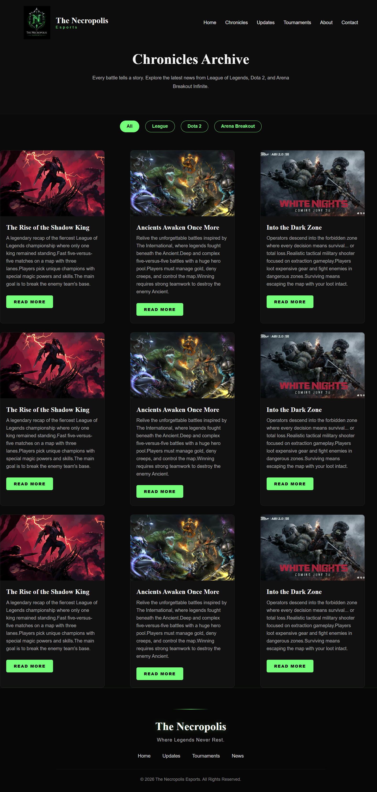
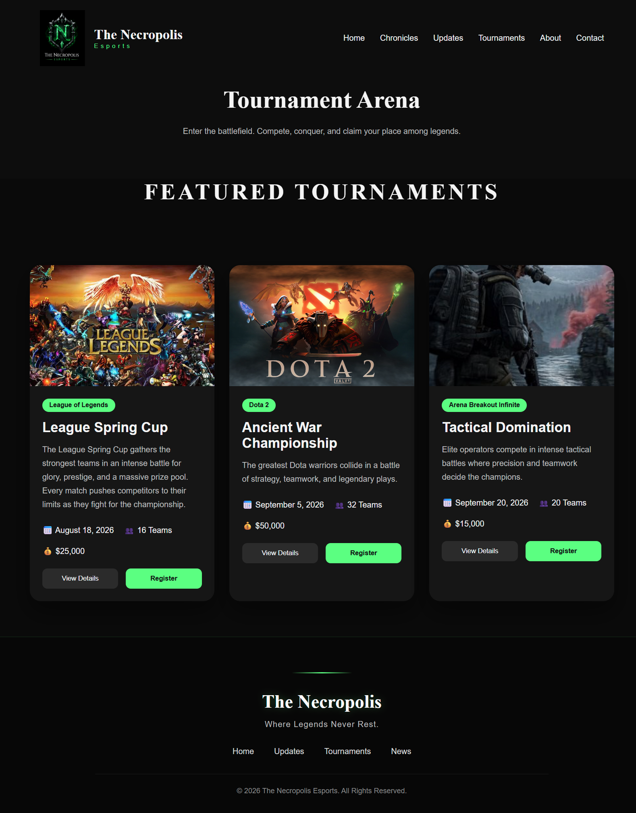
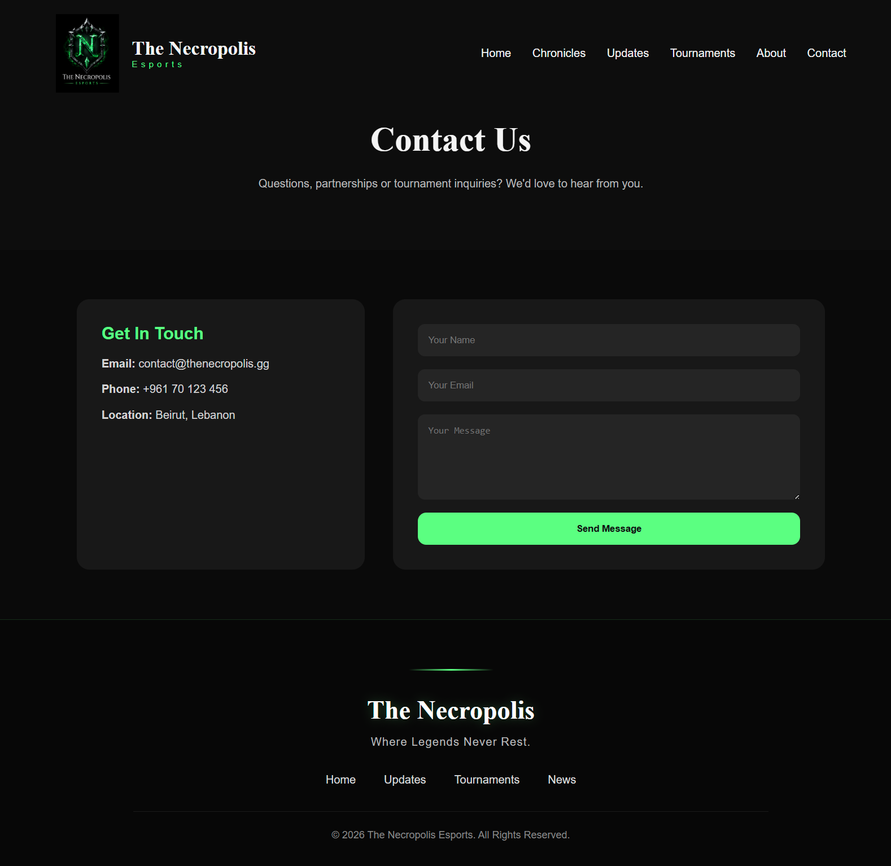
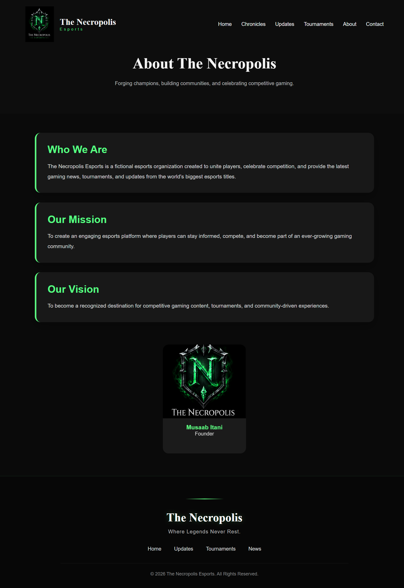

# The Necropolis Esports

The Necropolis Esports is a modern React-based esports website created as a university frontend development project. The website features a dark fantasy theme inspired by necromancers and provides information about tournaments, game updates, featured chronicles, competitive games, and the organization itself.

---

## Features

- Responsive modern interface
- React component-based architecture
- React Router navigation
- Interactive Hall of Legends carousel
- Tournament registration system
- Tournament details popup
- News filtering system
- Chronicle article popup
- Contact form
- Mobile responsive design

---

## Technologies Used

- React
- JavaScript (ES6)
- React Router DOM
- HTML5
- CSS3
- Git & GitHub

---

## Project Structure

```
src/
 ├── components/
 ├── pages/
 ├── css/
 ├── App.js
 └── index.js

public/
 └── images/
```

---

# Setup Instructions

1. Clone the repository

```bash
git clone https://github.com/MusaabItani/the-necropolis-react
```

2. Navigate to the project folder

```bash
cd the-necropolis-react
```

3. Install dependencies

```bash
npm install
```

4. Start the development server

```bash
npm start
```

The application will run at:

```
http://localhost:3000
```

---

# Screenshots

## Home Page


---

## Chronicles Page



---

## Tournament Page



---

## Contact Page



---

## About page



---

# Author

**Musaab Itani**

Computer Science Student

University Frontend Development Project
